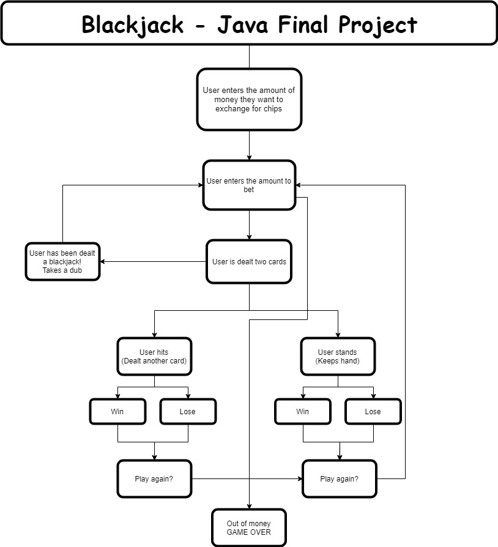

# Final - Blackjack by Alex and Logan

This is our game game adaptation of Blackjack or 21.
It functions as if you were playing it in the real world.

Gamble to your hearts content
Enter the amount of money you will likely lose

You are dealt two cards by the dealer who you are playing against.
You have the option to hit (recieve another card) or stand (keep current cards)

You will either win or lose, depending on what cards you or the dealer recieve
A loss will result in the money you bet to be taken from you :(
A win will double the money you bet, thus saving you from financial ruin, until you lose it again

